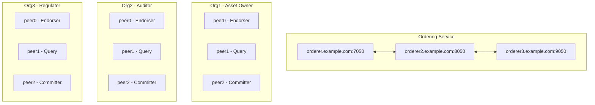

# Architecture Documentation

## System Overview

This Asset Approval System is built on Hyperledger Fabric v2.x with a focus on:
- **Scalability**: Configuration-driven, no chaincode changes for scaling
- **Low Latency**: Balanced block parameters, peer separation
- **Fault Tolerance**: Raft ordering, redundant peers

## Component Architecture

### Network Topology



### Peer Roles

| Peer Type | Chaincode | Purpose |
|-----------|-----------|---------|
| Endorser (peer0) | ✅ | Execute chaincode, sign proposals |
| Query (peer1) | ✅ | Handle read operations, offload endorsers |
| Committer (peer2) | ❌ | Validate & commit blocks only |

### Data Flow

```
Client Request
    │
    ├─── Pre-filter (ABAC check at client)
    │         │
    │         ▼
    ├─── Send to Endorsers (peer0.org1, peer0.org2 OR peer0.org3)
    │         │
    │         ▼
    ├─── Collect Endorsements
    │         │
    │         ▼
    ├─── Submit to Orderer (Raft)
    │         │
    │         ▼
    └─── Block distributed via Gossip → All peers commit
```

## Security Layers

### Layer 1: Channel ACLs
- Controls who can invoke/query
- Configured in `configtx.yaml`

### Layer 2: Endorsement Policy
```
AND('Org1MSP.peer', OR('Org2MSP.peer', 'Org3MSP.peer'))
```
- Asset Owner (Org1) always endorses
- Either Auditor or Regulator endorses

### Layer 3: ABAC (Chaincode)
```go
func requireRole(ctx, roles []string) error {
    role, _ := ctx.GetClientIdentity().GetAttributeValue("role")
    // Check role against allowed roles
}
```

### Layer 4: Client Pre-Filter
```javascript
const OPERATION_ROLES = {
    'CreateAsset': ['asset_owner'],
    'ApproveAsset': ['auditor', 'regulator'],
};
// Reject before hitting endorsers
```

## State Machine

```
            ┌────────────────┐
            │    CREATED     │
            └───────┬────────┘
                    │ SubmitForApproval
                    ▼
            ┌────────────────┐
            │PENDING_APPROVAL│
            └───────┬────────┘
           ┌────────┴────────┐
           │                 │
    Approve│                 │Reject
           ▼                 ▼
    ┌──────────┐      ┌──────────┐
    │ APPROVED │      │ REJECTED │──┐
    └────┬─────┘      └──────────┘  │
         │                          │
 Activate│              Resubmit   │
         ▼                          │
    ┌──────────┐                    │
    │  ACTIVE  │                    │
    └────┬─────┘                    │
         │                          │
   Delete│                          │
         ▼                          │
    ┌──────────┐                    │
    │ DELETED  │◄───────────────────┘
    └──────────┘
```

## Performance Configuration

### Block Tuning

| Parameter | Value | Effect |
|-----------|-------|--------|
| BatchTimeout | 200ms | Max wait before cutting block |
| MaxMessageCount | 50 | Max transactions per block |
| AbsoluteMaxBytes | 10MB | Max block size |
| PreferredMaxBytes | 2MB | Target block size |

### Trade-offs

```
Higher TPS ◄────────────────────► Lower Latency
    │                                   │
    │ BatchTimeout: 500ms               │ BatchTimeout: 100ms
    │ MaxMessageCount: 100              │ MaxMessageCount: 10
    │                                   │
    └───────────────────────────────────┘
          Current: Balanced at 200ms
```

## Private Data Collections

### PDC: assetPrivateOrg1Org2

| Property | Value |
|----------|-------|
| Members | Org1, Org2 |
| requiredPeerCount | 1 |
| maxPeerCount | 2 |
| blockToLive | 0 (permanent) |

**Org3 sees hash only, not actual data.**

## Scalability

### Horizontal Scaling (No Code Changes)
1. Add more peers → distribute load
2. Tune batch parameters → adjust TPS/latency
3. Add more orderers → higher fault tolerance

### Adding New Organizations
1. Generate MSP
2. Update channel config
3. No chaincode upgrade needed (ABAC uses roles)
